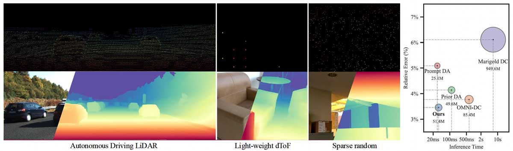

# Dense Metric Depth Completion from Sparse Direct Time-of-Flight Sensors
#### [Paper](https://arxiv.org/abs/2608.04737) | [Project Page](https://kaist-vclab.github.io/dToF-DMDC/) | [Models on HF](https://huggingface.co/summerbell/dToF-DMDC)

> [Hakyeong Kim](https://sites.google.com/view/hakyeongkim)<sup>1*</sup>, [Ruicheng Wang](https://wangrc.site/)<sup>2, 3</sup>, Chengtang Yao<sup>2</sup>, [Jiaolong Yang](https://jlyang.org/)<sup>2</sup>, [Min H. Kim](https://vclab.kaist.ac.kr/minhkim)<sup>1</sup> <br>
> <sup>1</sup>KAIST, <sup>2</sup>Microsoft Research Asia, <sup>3</sup>USTC <br>
> In CVPR 2026 <br>

This is the official implementation of the paper **"Dense Metric Depth Completion from Sparse Direct Time-of-Flight Sensors"**, presented at **CVPR 2026**.





dToF-DMDC is a high-performance framework designed to generate dense metric depth maps by fusing high-resolution RGB images with sparse depth from direct Time-of-Flight (dToF) sensors. By leveraging a novel fusion architecture, our method achieves state-of-the-art results with zero-shot generalization and real-time inference speeds.


## 🚀 Key Features
* **Dense Metric Accuracy:** Accurately reconstructs continuous metric depth maps from highly sparse dToF inputs.
* **Real-Time Inference:** Runs at approximately **32 FPS** on an NVIDIA A100 GPU in half-precision (FP16), featuring a lightweight and optimized architecture.
* **Strong Zero-Shot Generalization:** Verified across **6 diverse datasets**, seamlessly adapts to unseen environments without requiring domain-specific fine-tuning.
* **RGB-dToF Fusion:**  Depth-guided dual-branch encoder with masked joint attention, enabling effective and controlled feature exchange between RGB and sparse depth.


## 📦 Installation
### Requirements
- NVIDIA driver >= 570 (for CUDA 12.8)
- Tested on: A100 (sm_80), RTX 5090 (sm_120)

### Clone this repository

```bash
git clone git@github.com:KAIST-VCLAB/dToF-DMDC.git
cd dToF-DMDC
```

Set up the environment with **either** Docker **or** conda.


### Option A — conda

Run from the repo root.

```bash
conda env create -f environment.yml
conda activate dtof-dmdc
```

### Option B — Docker

Requires Docker + nvidia-container-toolkit.

```bash
docker build -t dtof-dmdc .
docker run --gpus all -it --name dtof-dmdc -v $(pwd):/code $path_to_dataset:/data dtof-dmdc
```

### Dataset 

## 🤗 Pretrained Models
Our pretrained models are available on the huggingface hub:
<table>
  <thead>
    <tr>
      <th>Model</th>
      <th>#Params</th>
      <th>Size</th>
    </tr>
  </thead>
  <tbody>
    <tr>
      <td><a href="https://huggingface.co/summerbell/dToF-DMDC/resolve/main/dtof_dmdc_vits.pt" target="_blank"><code>dtof_dmdc_vits.pt</code></a></td>
      <td>-</td>
      <td>206 MB</td>
    </tr>
    <tr>
      <td><a href="https://huggingface.co/summerbell/dToF-DMDC/resolve/main/dtof_dmdc_vitb.pt" target="_blank"><code>dtof_dmdc_vitb.pt</code></a></td>
      <td>-</td>
      <td>720 MB</td>
    </tr>
    <tr>
      <td><a href="https://huggingface.co/summerbell/dToF-DMDC/resolve/main/dtof_dmdc_vitl.pt" target="_blank"><code>dtof_dmdc_vitl.pt</code></a></td>
      <td>-</td>
      <td>2.5 GB</td>
    </tr>
  </tbody>
</table>

> **Note.** All quantitative evaluation and qualitative results in the paper are reported with `dtof_dmdc_vits.pt`.
> The ViT-B and ViT-L variants are additionally released to support reproducing the backbone ablation.

The code loads `dtof_dmdc_vits.pt` from the hub by default. Use `--variant {vits,vitb,vitl}`
to select a different backbone (e.g. `--variant vitl`), or pass a local checkpoint path to
`--pretrained` (in which case `--variant` is ignored).


## 💡 Minimal Code Example

Here is a minimal example for loading the model and completing a dense metric depth map
from an RGB image and a sparse depth map (e.g. from a dToF sensor).

```python
import numpy as np
import torch
from dtof_dmdc.model.dmdc import MoGeModel
from dtof_dmdc.utils.io import read_image, read_depth

device = torch.device("cuda")

# Load the model from huggingface hub (or a local checkpoint path).
model = MoGeModel.from_pretrained("summerbell/dToF-DMDC").to(device).eval()

# RGB image as tensor (3, H, W) with values normalized to [0, 1]
image = read_image("PATH_TO_IMAGE.jpg")  # (H, W, 3) uint8
image = torch.tensor(image / 255, dtype=torch.float32, device=device).permute(2, 0, 1)

# Sparse depth (H, W) in meters. read_depth() returns NaN/Inf for invalid pixels;
# derive the validity mask from the finite entries.
sparse_depth = read_depth("PATH_TO_SPARSE_DEPTH.png")  # (H, W) float32, meters
sparse_mask = np.isfinite(sparse_depth)
sparse_depth = torch.tensor(np.nan_to_num(sparse_depth), dtype=torch.float32, device=device)
sparse_mask = torch.tensor(sparse_mask, device=device)

# Infer a dense metric depth map.
output = model.infer(image, sparse_depth, sparse_mask)
"""
`output` has keys "depth", "mask", "intrinsics" (and "metric_depth" for metric scale).
The maps are the same size as the input image.
{
    "metric_depth": (H, W),        # dense metric depth map (meters)
    "mask": (H, W),         # binary mask for valid pixels
}
"""
```
For more usage details, see the `MoGeModel.infer()` docstring in [`dtof_dmdc/model/dmdc.py`](dtof_dmdc/model/dmdc.py)
and the reference wrapper in [`baselines/dtof_dmdc.py`](baselines/dtof_dmdc.py).

## 💡 Command-line Inference | `dtof-dmdc infer`

Run [`dtof_dmdc/scripts/infer.py`](dtof_dmdc/scripts/infer.py) on an RGB image and its sparse
depth map. `-i`/`-d` accept either a single file or a folder (folders are matched by filename stem).
The sparse depth (`-d`) can be a plain `.npy` array in meters (invalid pixels as `NaN` or `<= 0`)
or a 16-bit `.png` in the dToF-DMDC format:

```bash
# Save the 2D output [maps] (image, depth, mask, normal)
dtof-dmdc infer -i IMAGE_OR_FOLDER -d SPARSE_DEPTH_OR_FOLDER -o OUTPUT_FOLDER --maps

# Save the [maps], [glb] and [ply] files (KITTI FoV shown as an example)
dtof-dmdc infer -i IMAGE_OR_FOLDER -d SPARSE_DEPTH_OR_FOLDER -o OUTPUT_FOLDER --maps --glb --ply --fov_x 80.4 --fov_y 27.5

# Show the result in a window (needs pyglet<2, included in requirements.txt)
dtof-dmdc infer -i IMAGE_OR_FOLDER -d SPARSE_DEPTH_OR_FOLDER -o OUTPUT_FOLDER --show --fov_x 80.4 --fov_y 27.5
```

dToF-DMDC predicts metric depth only, so the camera intrinsics used to unproject it into 3D come
from the field of view you pass in. `--fov_x` and `--fov_y` (degrees) are therefore **required for
the 3D outputs** (`--glb`, `--ply`, `--show`). They are optional for `--maps`, which then writes the
point map and `fov.json` only when `--fov_x` is given.

Run `dtof-dmdc infer --help` for all options (`--pretrained`, `--variant`, `--fp16`,
`--resolution_level`, `--num_image_tokens`, `--num_depth_tokens`, `--threshold`).

## 🧪 Evaluation

We provide reproducible evaluation on **KITTI** (real sparse LiDAR) and **ETH3D**
(random sparse sampling). See [docs/eval.md](docs/eval.md) for dataset preparation and commands.

## ⚖️ License & Acknowledgement

This code is built upon [MoGe](https://github.com/microsoft/MoGe) and is released under the MIT license, except for DINOv2 code in `dtof_dmdc/model/dinov2` which is released by Meta AI under the Apache 2.0 license. 
See [LICENSE](LICENSE) for more details.


## 📜 Citation

If you find our work useful in your research, we gratefully request that you consider citing our paper:

```
@inproceedings{kim2026dense,
  title={Dense Metric Depth Completion from Sparse Direct Time-of-Flight Sensors},
  author={Kim, Hakyeong and Wang, Ruicheng and Yao, Chengtang and Yang, Jiaolong and Kim, Min H},
  booktitle={Proceedings of the IEEE/CVF Conference on Computer Vision and Pattern Recognition},
  pages={36518--36528},
  year={2026}
}
```
